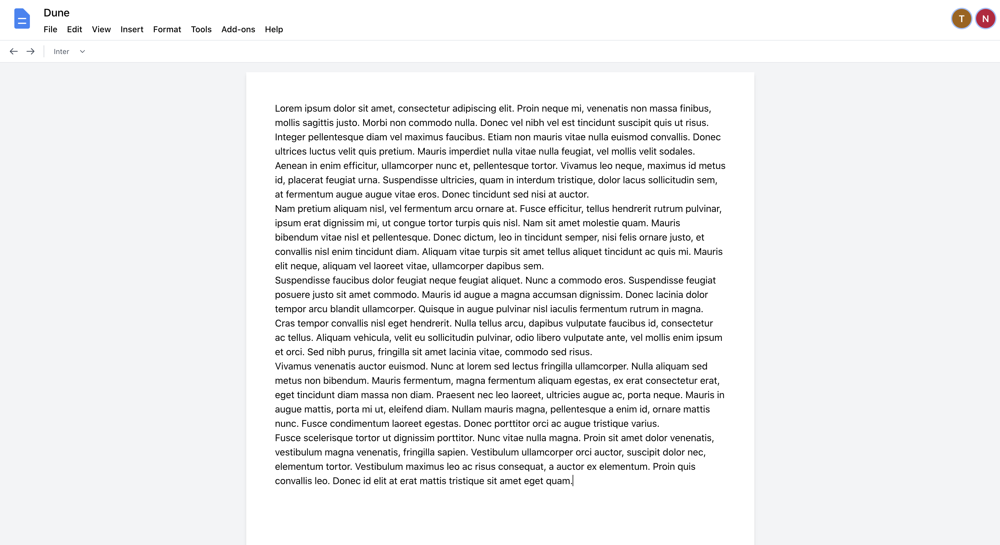

## Google Docs Clone

Built with React, Typescript, TailwindCSS, ExpressJS, Postgres, and Socket.IO
[Check it out!](https://docs.noahgothacked.com)

### API Documentation

[View it here!](https://documenter.getpostman.com/view/12120504/UVyoWHgt)

## Project Screen Shot(s)

- Full Register/Login/Verify Email functionality, with helpful toast notifications to guide you.
  

- Basic document dashboard to create new documents, and navigate to your recent or shared documents.
  

- Real time collaboration. Work on documents at the same time with those you've shared the document with.
  

## Installation and Setup Instructions

Clone down this repository. You will need node and npm installed globally on your machine.

Client Installation:

`cd client`

Install Dependencies:

`npm install`

To Start Server:

`npm start`

To Visit App:

`localhost:3000`

Server Installation:

`cd server`

Create the .env file in the root directory:

`touch .env.development`

You will need to add all of the neccessary environment variables in this file [located here](server/src/config/env.config.ts)

Install Dependencies:

`npm install`

To Start Server:

`npm start`

To Visit App:

`localhost:3001`

## Reflection

This was a week long project I used to learn web sockets, and sharpen my React skills. While the project has a ton o functionality that could still be added, I reached my goals. I used Socket.IO to create and consume web sockets, to provide real-time collaboration between your peers, similar to Google Docs. I learned a lot about react particularly on how to structure and consume Contexts and Hooks.

If I wanted to work more on this project, the next thing I would do is refactor my client service files. I am using the React Context API to provide a global AuthContext which stores my JWT accessToken in memory. However, my service files are plain typescript files, and cannot make use of the Context API. This makes it tedious to provide the accessToken to these services, as I have to pass the token as an argument each time. My first thoughts on how to fix this would be to create custom Hooks for each service, let me know if you can think of a better way!

Overall, I had a lot of fun working on this project. It was nice to not have to worry about designing a front end (and just copying Google's hard work). I am looking forward to trying more 'clone' projects in the future!
